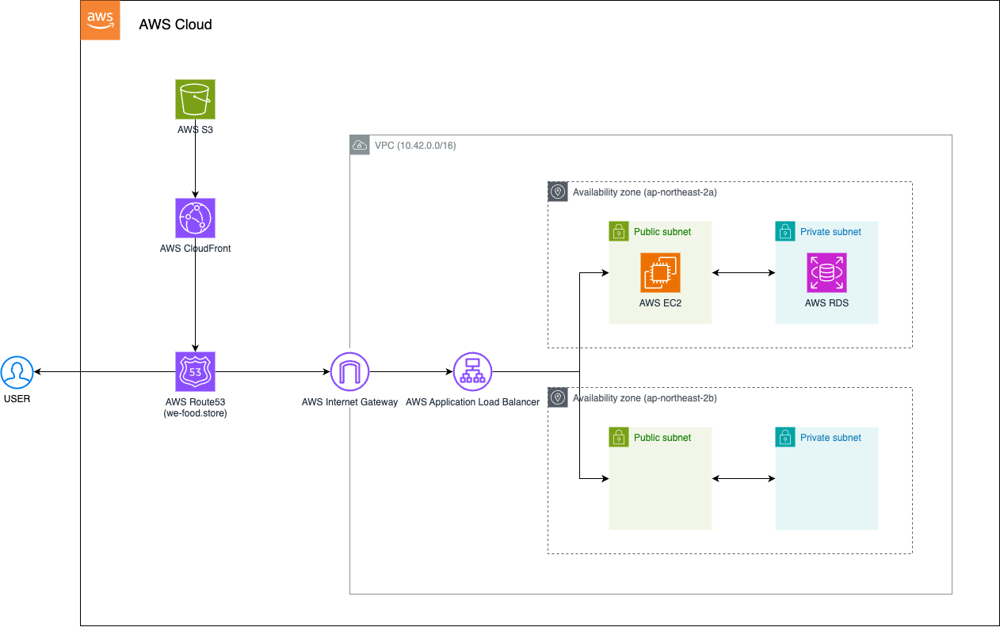

# We-Food-IAC

&nbsp; We-Food 프로젝트의 Infrastructure as Code (IAC) 레포지토리

## Infrastructure as Code (IaC) 전략

We-Food 프로젝트에서는 Terraform을 활용한 Infrastructure as Code (IaC) 전략을 채택하고 있다.

### 1. 인프라 버전 관리

- 코드로 인프라를 정의하여 Git과 같은 버전 관리 시스템을 통해 인프라의 변경 사항을 추적하고 관리할 수 있다.
- 이를 통해 인프라의 변경 이력을 쉽게 확인하고, 필요시 이전 상태로 롤백할 수 있다.

### 2. 인프라 일관성 유지

- 코드로 정의된 인프라를 통해 개발, 스테이징, 프로덕션 환경 간의 일관성을 유지할 수 있다.
- 휴먼 에러를 줄이고, 모든 환경에서 동일한 구성을 보장한다.

### 3. 자동화 및 효율성

- 인프라 프로비저닝 및 관리 프로세스를 자동화하여 시간과 노력을 절약한다.
- 복잡한 인프라 설정을 간단한 명령어로 배포하고 관리할 수 있다.

### 4. 협업 강화

- 인프라 코드를 통해 팀원 간 협업이 용이해지며, 코드 리뷰를 통해 인프라 변경 사항을 검토할 수 있다.
- 문서화의 효과도 얻을 수 있어, 새로운 팀원의 온보딩 과정을 간소화할 수 있다.

### 5. 비용 최적화

- 인프라 리소스를 코드로 정의함으로써 불필요한 리소스를 쉽게 식별하고 제거할 수 있다.
- 테스트 환경의 자동 생성 및 삭제를 통해 비용을 절감할 수 있다.

### 6. 보안 및 컴플라이언스

- 인프라 구성을 코드로 관리함으로써 보안 정책을 일관되게 적용할 수 있다.
- 변경 사항을 추적하고 감사할 수 있어 컴플라이언스 요구사항을 충족하는 데 도움을 얻고자 한다.

&nbsp; 이러한 이점들을 통해 We-Food 프로젝트의 인프라를 더욱 효율적으로 관리하고, 확장성과 유지보수성을 높이고자 한다.

## Architecture



## 리소스 설명

### AWS S3

- 정적 웹 콘텐츠 및 미디어 파일 저장소로 사용
- CloudFront와 연계하여 정적 컨텐츠 전송 속도를 향상시키는 것이 목표

### AWS CloudFront

- 전역 콘텐츠 전송 네트워크(CDN)로 사용
- S3에 저장된 정적 콘텐츠를 사용자에게 빠르게 전달

### AWS Route 53

- DNS 서비스로 사용
- 도메인 이름을 관리하고 트래픽을 적절한 AWS 리소스로 라우팅

### AWS Internet Gateway

- VPC와 인터넷 간의 통신을 가능하게 함
- 공용 서브넷의 리소스가 인터넷에 접근할 수 있도록 함

### AWS Application Load Balancer

- 들어오는 애플리케이션 트래픽을 여러 EC2 인스턴스로 분산
- HTTPS 종단점을 제공하고 SSL/TLS 인증서 관리

### AWS EC2

- 애플리케이션 서버(Web, WAS)로 사용
- 웹 서버와 애플리케이션 로직을 호스팅

### AWS RDS

- 관계형 데이터베이스 서비스(PaaS)로 사용
- 애플리케이션의 데이터를 저장하고 관리

### VPC (Virtual Private Cloud)

- 격리된 가상 네트워크 환경을 제공
- 보안 그룹과 네트워크 ACL을 통해 네트워크 접근 제어

### Public Subnet

- 인터넷에서 직접 접근 가능한 리소스를 호스팅

### Private Subnet

- 인터넷에서 직접 접근할 수 없는 리소스를 호스팅
- EC2 인스턴스와 RDS 데이터베이스가 위치하여 보안을 강화하는 것이 목표

### Availability Zones

- 물리적으로 분리된 데이터 센터를 의미
- 고가용성과 내결함성을 제공하기 위해 리소스를 여러 AZ에 분산 배치
- 현재 프로젝트에서는 ALB를 사용하기 위해 비어있는 Subnet을 배치하기 위해 사용

## Bastion Host 접속 방법

&nbsp; 보안을 위해 프라이빗 서브넷의 리소스에 접근할 때는 Bastion Host를 통해 접속한다.

```bash
chmod 400 xxx.pem
ssh -i xxx.pem xxx@xxx.xxx.xxx.xxx
```
